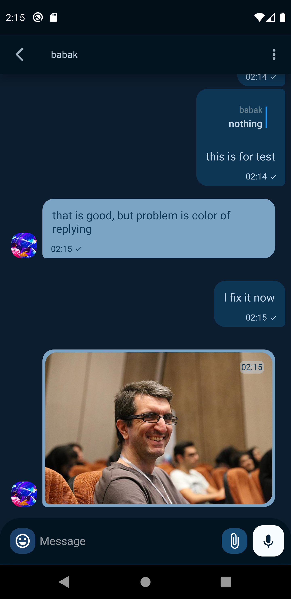
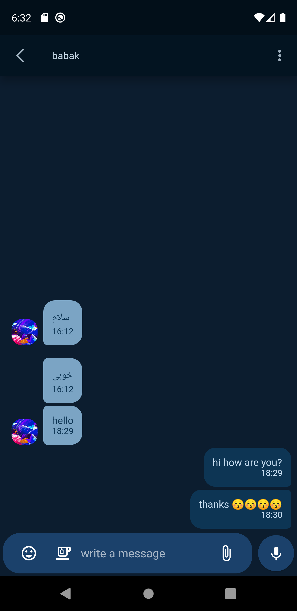
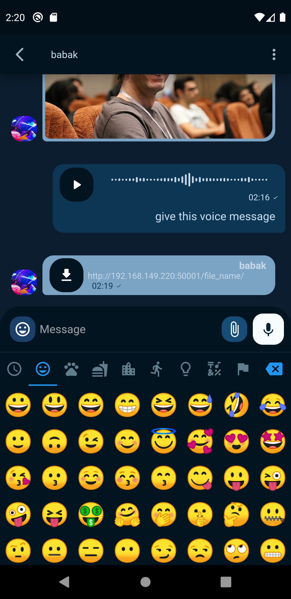
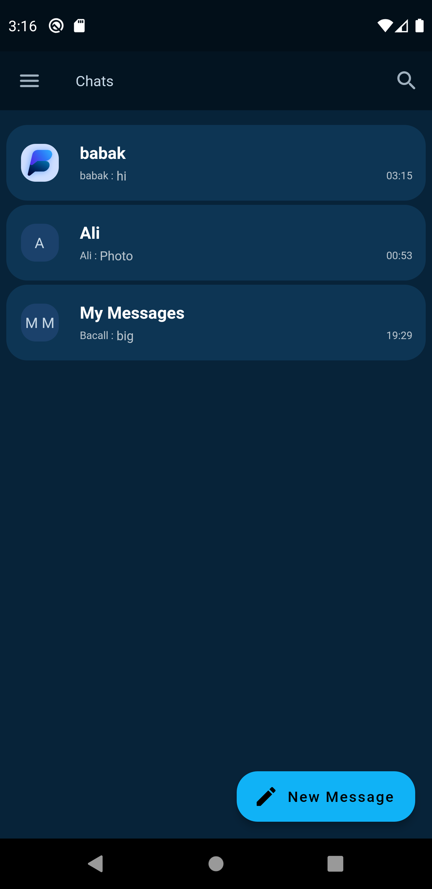
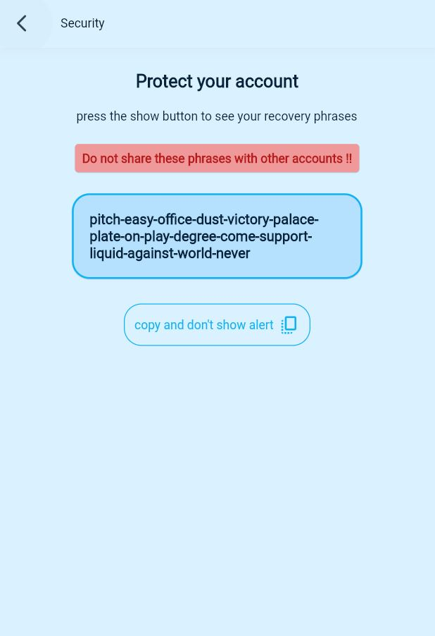
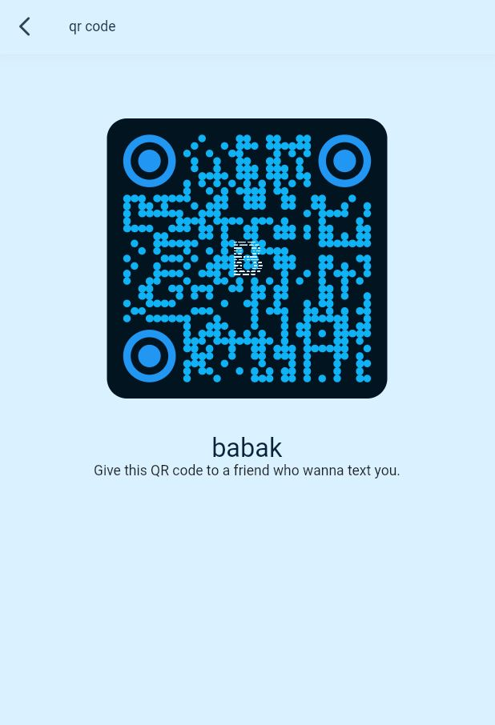

# Business Chat application

A chat application like telegram using **flutter**;

<br>


## screenshots
### android application
<p float="left">
  
   
  
  
  
  
</p>


### web application

<p float="left">
  
   
</p>

for flutter developers:
### Getting Started
```shel
git clone https://github.com/heorhiikanir/business_flutter.git
cd business_flutter
flutter pub get
flutter run 
```
